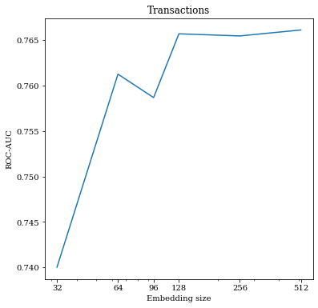
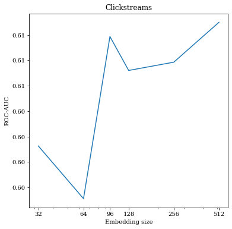

# "Machine learning" course Final Project
## Team: ClosedAI_ML_Project

Hello! We are ML team who is predicting whether the bank clients have higher education or not using the embeddings, built through variety of models on datasets of transactions and clickstreams.

### Team members:

- Denis Grankin
- Ekaterina Anreichuk
- Ivan Apanasevich
- Mikhail Konenkov
- Irena Gureeva
## Topic: Contrastive Learning for Event Sequences with Self-Supervision on multiple domains
This repository contains Python code for conducting experiments to compare CoLES with other methods of embeddings creation, such as Random Encoder and Agg baseline on different types of sequential data: transactions and clickstream. Also several experiments to define best parameters for CoLES were conducted.

CoLES is a self-supervised method for embeddings, which is based on contrastive learning. This method aims to learn a representation such that it brings closer semantically similar pairs closer to each other in embeddings space, while brings dissimilar objects further apart.
## Prerequisites 
Most of the notebooks can be directly run in Google Collab.
For launching `notebooks/clickstreams.ipynb` PySpark is needed. The actions to configure PySpark can be found [here](https://www.datacamp.com/tutorial/installation-of-pyspark).  
Versions: `Spark version 3.3.2; Hadoop version 2.7`  
`findspark` module and `PySpark` module should also be installed via `!pip install findspark` and `!pip install PySpark` respectively.  
## Related documents
[Repository](https://github.com/dllllb/pytorch-lifestream) of the `pytorch-lifestream` library that was used during this project.  
[CoLES](https://arxiv.org/abs/2002.08232) paper, which introduce CoLES method and presents experiments with it. In the framework of our project we were to replicate this paper.
## Structure of the repository 
Main files, that represents out work are:
-  `./notebooks` directory contains jupyter notebooks with conducted experiments. More detailed description of contents of this notebooks are presented in `./notebooks/Readme.md`
- `./Docs` directory contains documents (Project presentation and Project Report), which presents our work in more detail.
## Datasets 
The data was taken from [Data Fusion 2022 competition](https://ods.ai/competitions/data-fusion2022-education/dataset). Main files are [transactions.zip](https://storage.yandexcloud.net/datasouls-ods/materials/0433a4ca/transactions.zip) (transactions dataset), [clickstream.zip](https://storage.yandexcloud.net/datasouls-ods/materials/0554f0cf/clickstream.zip) (clickstream dataset),[train_matching.zip](https://storage.yandexcloud.net/datasouls-ods/materials/acfacf11/train_matching.csv) (dataset of matched user IDs in clickstream dataset and transactions dataset), [train.csv](https://storage.yandexcloud.net/datasouls-ods/materials/e756bf99/train.csv) (dataset, containing the target for the downstream task)
## Results
CoLES is a effective embedding technique. In comparison with Random feature encoder,embeddings achieved using CoLES showed better results for Clickstream and Transactions datasets, which can be seen in higher accuracy, ROC-AUC score and F1 score. But in comparison with aggregate feature encoder,which is a powerful baseline, CoLES achieved lower score. But yet, further investigation of CoLES hyperparameters is needed as score still may be improved with best hyperparameters. 

|Metric| Transactions_agg | transactions_random | transactions_coles|clickstreams_agg|clickstreams_random|clickstreams_coles|
|-------:| ------------- |:-------------:| -----:|-----:|-----:|-----:|
|F1|0.865|0.850|0.862|0.842|0.842|0.833|
|ROC_AUC|**0.799**|0.597|*0.758*|0.556|0.552|0.594|
|Precision|0.919|0.993|0.961|1.00|1.00|1.00|
|Accuracy|0.787|0.741|0.771|0.728|0.728|0.715|

The dependency of the embedding size on the quality of supervised task was also demonstrated . It was found that with the growing embedding size , the quality on the downstream task also increases for both transactions and clickstreams datasets. 

Different types of encoders were evaluated on the downstream task. It was found that `GRU` encoder shows best quality for both of the datasets. 
|Method|Transactions|Clickstream|
|-------:| ------------- |:-------------:|
|GRU|**0.761**|**0.598**|
|LSTM|0.753|0.577|
The quality of CoLES on downstream task with different  sampling techniques were also obtained. `SampleRandom` technique was best for Transactions dataset, while `SplitRandom` was better for Clickstreams dataset.
|Method|Transactions|Clickstream|
|-------:| ------------- |:-------------:|
|SampleSlices|0.761|0.598|
|SplitRandom|0.749|**0.600**|
|SampleRandom|**0.768**|0.590|
